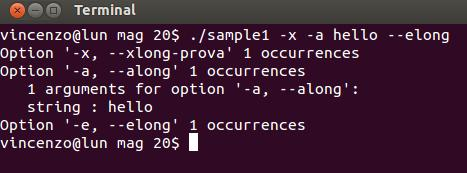
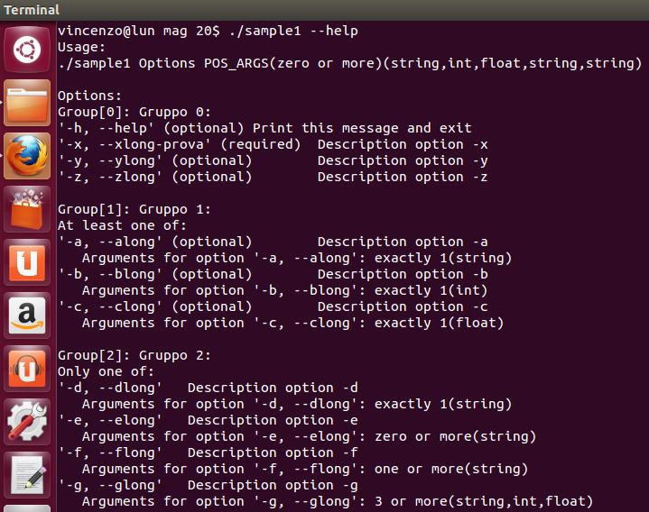
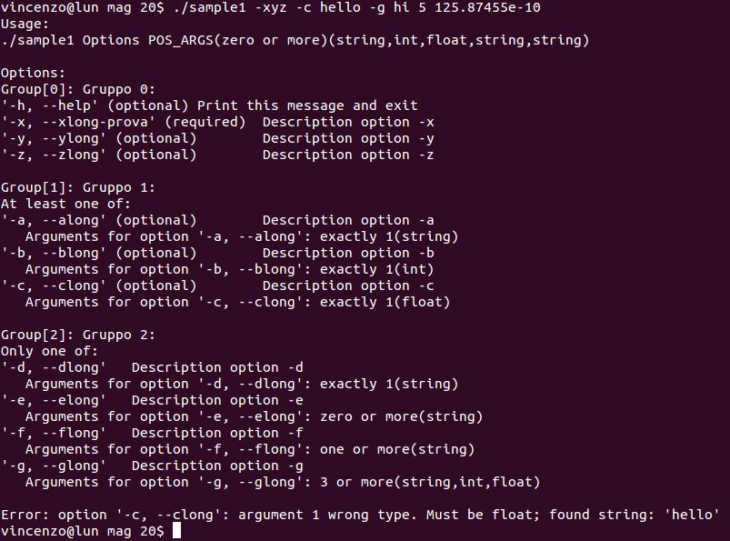

Per usare la libreria bisogna includere il file "myoptParser.h":

    #include "myoptParser.h"

Bisogna inoltre specificare al linker che vogliamo usare la libreria tramite l'opzione -l.
Per esempio:

    gcc -Wall -W -O2 -std=c99 -L. sample1.c -lmyoptParser -o sample1

Interfaccia Utente
------------------

La prima cosa da fare è chiamare la funzione "myopt_InitParser":

```c
    parser = myopt_InitParser();
    if ( !parser )
        return -1;
```

La funzionme ritorna un puntatore alla struct "_myopt_Parser_t".
Tale puntatore va usato come primo argomento in tutte le altre funzioni della libreria ed è. quindi, molto importante verificare che il puntatore ritornato non sia NULL prima di continuare.

Il passo successivo consiste nel chiamare la funzione "myopt_AddGroup":

```c
    idGroup = myopt_AddGroup(parser, "Group 0", false, false);
```

Il prototipo della funzione è il seguente:

```c
    int32_t myopt_AddGroup(myopt_Parser_t parser, const char *strDescription, bool bMutuallyExclusive, bool bRequired);
```

Il primo parametro è il puntatore ritornato dalla chiamata a "myopt_InitParser."
Il parametro "strDescription" è la descrizione del gruppo.
Il parametro "bMutuallyExclusive" è un valore booleano; bisogna specificare "true" se si vuole che le opzioni del gruppo siano mutualmente esclusive. Se questo parametro è impostato a "true" e l'utente specifica più di un'opzione del gruppo, il parser restituisce un errore.
Il parametro "bRequired" è un valore booleano: "true" indica che almeno una(e una e soltanto una se "bMutuallyEsclusive è impostato a "true") delle opzioni appartenenti al gruppo deve essere specificata dall'utente sulla linea di comando.

Il passo successivo consiste nell'aggiunta delle opzioni al gruppo creato in precedenza; bisogna usare la funzione "myopt_AddOption".
Il prototipo della funzione è il seguente:

```c
    bool myopt_AddOption(myopt_Parser_t parser,
                         int32_t idGroup,
                         char shortName,
                         const char *longName,
                         const char *strDescription,
                         bool bRequired,
                         myopt_MOBEnum eMob,
                         int32_t nArgsMin,
                         int32_t nArgsMax,                     
                         const char *strTypes);
```

Il parametro "bRequired" viene valutato se e solo se è stato specificato "false" per entrambi i parametri "bMutuallyEsclusive" e "bRequired" nella precedente chiamata alla funzione "myopt_AddGroup".

Il parametro "eMob" è un tipo enumerativo.
MOB = Multiple Occurrences Behavior.
Specifies the behavior that the parser assumes if the option is specified more than once.
Indica il comportamento che deve assumere il parser se un'opzione viene specificata più di una volta dall'utente.
Può assumere i seguenti valori:

- MOB_ERROR     Il parser ritorna un errore.
- MOB_OVERRIDE  Il parser sovrascriverà il valore dell'argomento(i) precedente(i); viene considerata, dunque, soltanto l'ultima occorrenza.
- MOB_APPEND    Il parser ritorna una lista degli argomenti.

I parametri "nArgsMin" e "nArgsMax" specificano, rispettivamente, Il minimo e il massimo numero di argomenti che un'opzione può avere.
È possibile impostare entrambi i parametri a zero per specificare un'opzione che non accetta argomenti.
Per il parametro "nArgsMax" è possibile usare la macro OR_MORE.
Per esempio, se si vuole che un'opzione accetti zero o più argomenti, si imposto "nArgsMin" = 0 e "nArgsMax" = OR_MORE.
Se si vuole che un'opzione accetti uno o più argomenti, si imposti "nArgsMin" = 1 e "nArgsMax" = OR_MORE.
Se si vuole che un'opzione accetti da tre a cinque argomenti, si imposti "nArgsMin" = 3 e "nArgsMax" = 5.
Se si vule che un'opzione accetti esattamente un argomento, si imposti "nArgsMin" = 1 e "nArgsMax" = 1.
E così via.

Il parametro "strTypes" è una stringa con la quale è possibile specificare il tipo degli argomenti.
Possono essere specificati i seguenti tipi:

- "string"   specifica un argomento di tipo stringa.
- "int"      specifica un argomento di tipo numero intero.
- "float"    specifica un argomento di tipo numero in virgole mobile.

Se l'opzione prevede più di un argomento, è possibile specificare più tipi separandoli con una virgola.
Per esempio, se "nArgsMin" = 2 e "nArgsMax" = 2, possiamo specificare che il primo argomento dev'essere di tipo stringa e il secondo di tipo numero intero, in questo modo: "string, int".
Se i tipi specificati in "strTypes" risultano in numero minore rispetto agli argomenti che un'opzione può accettare, per gli argomenti successivi viene assunto l'ultimo tipo specificato nella stringa.
Per esempio, se "nArgsMin" = 3 e "nArgsMax" = 3 e "strTypes" = "string, float", il primo argomento è considerato di tipo stringa, il secondo di tipo float e il terzo sarà anch'esso considerato di tipo float.
È possibile impostare "strTypes a NULL o alla stringa vuota "". In tal caso gli argomenti saranno considerati tutti di tipo stringa.

Di default il parser accetta zero o più argomenti posizionali, tutti di tipo stringa.
È possibile modificare questo comportamento chiamando la funzione "myopt_SetPositionalArgsParams".
Per esempio:

```c
    myopt_SetPositionalArgsParams(parser, "POS_ARGS", 0, 3, "string, int, float");
```

Con la precedente chiamata diciamo al parser che deve accettare da zero a tre argomenti posizionali.
Se l'utente digita più di tre argomenti posizionali, il parser restituisce un errore.
Se vogliamo che la nostra applicazione non accetti argomenti posizionali, possiamo effettuare la seguente chiamata:

```c
    myopt_SetPositionalArgsParams(parser, "POS_ARGS", 0, 0, "");
```

Il passo successivo consiste nel chiamare la funzione "myopt_ParseArray":

```c
    bParse = myopt_ParseArray(parser, argc, argv);
	
    if ( parser->countInternalErrors > 0 )
    {
        printf("Internal errors:\n");
        printf(parser->strInternalErrors);
        return -1;
    }		
```

La funzione ritorna true se il parser non ha trovato errori.

Anche se l'utente ha digitato correttamente le opzioni della riga di comando, prima di procedere è necessario controllare che la variabile "countInternalErrors" sia uguale a zero.
Un tipico errore interno potrebbe essere una specificazione di tipo non valida: "sting, int, float": "sting" invece di "string".

If everything is ok we can proceed to the reading of the options and related arguments:
Se è tutto ok, possiamo procedere con la lettura delle opzioni(e relativi argomenti) specificate dall'utente:

```c
	if ( !bParse )
	{
		printf(parser->strUsage);
		printf(parser->strErrors);
		myopt_FreeParser(parser);
		return -1;		
	}
```

Il seguente frammento di codice stampa la lista delle opzioni(e relativi argomenti) specificate dall'utente sulla linea di comando:

```c
	for ( x = 0; x < parser->countOptArgs; x++ )
	{
		if ( parser->arrayOptArgs[x].countOccurrences > 0 )
		{
			myopt_MakeOptionName(parser->arrayOptArgs[x].shortName, parser->arrayOptArgs[x].longName, strOptionName);
			printf("Option '%s' %d occurrences\n", strOptionName, parser->arrayOptArgs[x].countOccurrences);
			if ( parser->arrayOptArgs[x].countArgs > 0 )
				printf("   %d arguments for option '%s':\n", parser->arrayOptArgs[x].countArgs, strOptionName);
			for ( y = 0; y < parser->arrayOptArgs[x].countArgs; y++ )
			{
				switch ( parser->arrayOptArgs[x].arrayArgs[y].Type )
				{
					case T_STRING:			
						printf("   string : %s", parser->arrayOptArgs[x].arrayArgs[y].strValue);
						break;
					case T_INT:
						printf("   int    : %lli", (long long int)parser->arrayOptArgs[x].arrayArgs[y].intValue);
						break;
					case T_FLOAT:
						printf("   float  : %g", parser->arrayOptArgs[x].arrayArgs[y].floatValue);
						break;
				}
				printf("\n");
			}			
		}			
	}

```

Per stampare la lista degli argomenti posizionali:

```c
	if ( parser->countPosArgs )
		printf("\nList of positional argument:\n");
	for ( x = 0; x < parser->countPosArgs; x++ )
	{
		switch (parser->arrayPosArgs[x].Type )
		{
			case T_STRING:			
				printf("string : %s", parser->arrayPosArgs[x].strValue);
				break;
			case T_INT:
				printf("int    : %lli", (long long int)parser->arrayPosArgs[x].intValue);
				break;
			case T_FLOAT:
				printf("float  : %g", parser->arrayPosArgs[x].floatValue);
				break;
		}
		printf("\n");
	}
```

Infine, è necessario chiamare la funzione "myopt_FreeParser" per liberare la memoria allocata dalla chiamata alla funzione "myopt_InitParser":

```c
    myopt_FreeParser(parser);
```

Un esempio completo:
====================

```c
#include <stdio.h>
#include <stdlib.h>
#include <string.h>
#include <stdint.h>
#include <stdbool.h>
#include <stdint.h>

#include "myoptParser.h"

int main(int argc, char* argv[])
{
	myopt_Parser_t parser;
	int x, y;
	char strOptionName[1024];
	char strDescr[MAX_LEN_STR + 1];
	int32_t idGroup;
	int32_t idOption;
	bool bParse;
		
	parser = myopt_InitParser();
	if ( !parser )
		return -1;

	idGroup = myopt_AddGroup(parser, "Gruppo 0", false, false);
	
	strcpy(strDescr, "Print this message and exit");
	myopt_AddOption(parser, idGroup, 'h', "help", strDescr, false, MOB_OVERRIDE, 0, 0, "");	

	strcpy(strDescr, "Description option -x");
	myopt_AddOption(parser, idGroup, 'x', "xlong-prova", strDescr, true, MOB_OVERRIDE, 0, 0, "");
	
	strcpy(strDescr, "Description option -y");	
	myopt_AddOption(parser, idGroup, 'y', "ylong", strDescr, false, MOB_OVERRIDE, 0, 0, "");
	
	strcpy(strDescr, "Description option -z");	
	myopt_AddOption(parser, idGroup, 'z', "zlong", strDescr, false, MOB_ERROR, 0, 0, "");


	idGroup = myopt_AddGroup(parser, "Gruppo 1", false, true);

	strcpy(strDescr, "Description option -a");
	myopt_AddOption(parser, idGroup, 'a', "along", strDescr, false, MOB_OVERRIDE, 1, 1, "string");
	
	strcpy(strDescr, "Description option -b");	
	myopt_AddOption(parser, idGroup, 'b', "blong", strDescr, false, MOB_APPEND, 1, 1, "int");
	
	strcpy(strDescr, "Description option -c");	
	myopt_AddOption(parser, idGroup, 'c', "clong", strDescr, false, MOB_APPEND, 1, 1, "float");
	
	
	idGroup = myopt_AddGroup(parser, "Gruppo 2", true, true);
	
	strcpy(strDescr, "Description option -d");	
	myopt_AddOption(parser, idGroup, 'd', "dlong", strDescr, false, MOB_OVERRIDE, 1, 1, "string");
	
	strcpy(strDescr, "Description option -e");	
	myopt_AddOption(parser, idGroup, 'e', "elong", strDescr, false, MOB_ERROR, 0, OR_MORE, "string");
	
	strcpy(strDescr, "Description option -f");	
	myopt_AddOption(parser, idGroup, 'f', "flong", strDescr, false, MOB_ERROR, 1, OR_MORE, "string");
	
	strcpy(strDescr, "Description option -g");	
	myopt_AddOption(parser, idGroup, 'g', "glong", strDescr, false, MOB_ERROR, 3, OR_MORE, "string, int, float");
	
	myopt_SetPositionalArgsParams(parser, "POS_ARGS", 0, OR_MORE, "string, int, float, string, string");
		
	bParse = myopt_ParseArray(parser, argc, argv);
	
	if ( parser->countInternalErrors > 0 )
	{
		printf("Internal errors:\n");
		printf(parser->strInternalErrors);
		return -1;
	}		
	
	//idOption = myopt_LookupShort(parser, 'h');
	idOption = myopt_LookupLong(parser, "help");
	if ( idOption >= 0 && parser->arrayOptArgs[idOption].countOccurrences > 0 )
	{
		printf(parser->strUsage);
		myopt_FreeParser(parser);
		return 0;
	}	
	
	if ( !bParse )
	{
		printf(parser->strUsage);
		printf(parser->strErrors);
		myopt_FreeParser(parser);
		return -1;		
	}
		
	for ( x = 0; x < parser->countOptArgs; x++ )
	{
		if ( parser->arrayOptArgs[x].countOccurrences > 0 )
		{
			myopt_MakeOptionName(parser->arrayOptArgs[x].shortName, parser->arrayOptArgs[x].longName, strOptionName);
			printf("Option '%s' %d occurrences\n", strOptionName, parser->arrayOptArgs[x].countOccurrences);
			if ( parser->arrayOptArgs[x].countArgs > 0 )
				printf("   %d arguments for option '%s':\n", parser->arrayOptArgs[x].countArgs, strOptionName);
			for ( y = 0; y < parser->arrayOptArgs[x].countArgs; y++ )
			{
				switch ( parser->arrayOptArgs[x].arrayArgs[y].Type )
				{
					case T_STRING:			
						printf("   string : %s", parser->arrayOptArgs[x].arrayArgs[y].strValue);
						break;
					case T_INT:
						printf("   int    : %lli", (long long int)parser->arrayOptArgs[x].arrayArgs[y].intValue);
						break;
					case T_FLOAT:
						printf("   float  : %g", parser->arrayOptArgs[x].arrayArgs[y].floatValue);
						break;
				}
				printf("\n");
			}			
		}			
	}
		
	if ( parser->countPosArgs )
		printf("\nList of positional argument:\n");
	for ( x = 0; x < parser->countPosArgs; x++ )
	{
		switch (parser->arrayPosArgs[x].Type )
		{
			case T_STRING:			
				printf("string : %s", parser->arrayPosArgs[x].strValue);
				break;
			case T_INT:
				printf("int    : %lli", (long long int)parser->arrayPosArgs[x].intValue);
				break;
			case T_FLOAT:
				printf("float  : %g", parser->arrayPosArgs[x].floatValue);
				break;
		}
		printf("\n");
	}
		
	myopt_FreeParser(parser);
	
	return 0;
}
```
<table border="0">
    <tr><td>.</td></tr>
    <tr><td></td></tr>
    <tr><td>.</td></tr>
    <tr><td></td></tr>
    <tr><td>.</td></tr>
    <tr><td></td></tr>
    <tr><td>.</td></tr>
    <tr><td></td></tr>
    <tr><td>.</td></tr>
    <tr><td></td></tr>    
</table>

