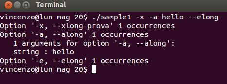
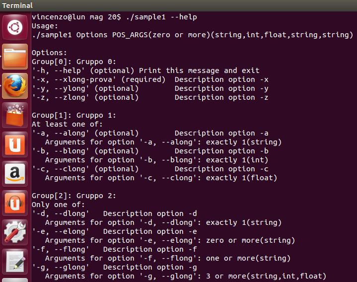
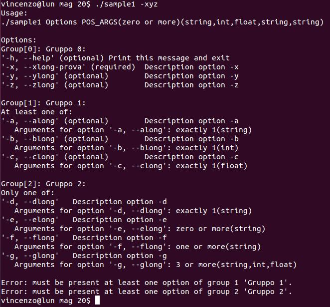
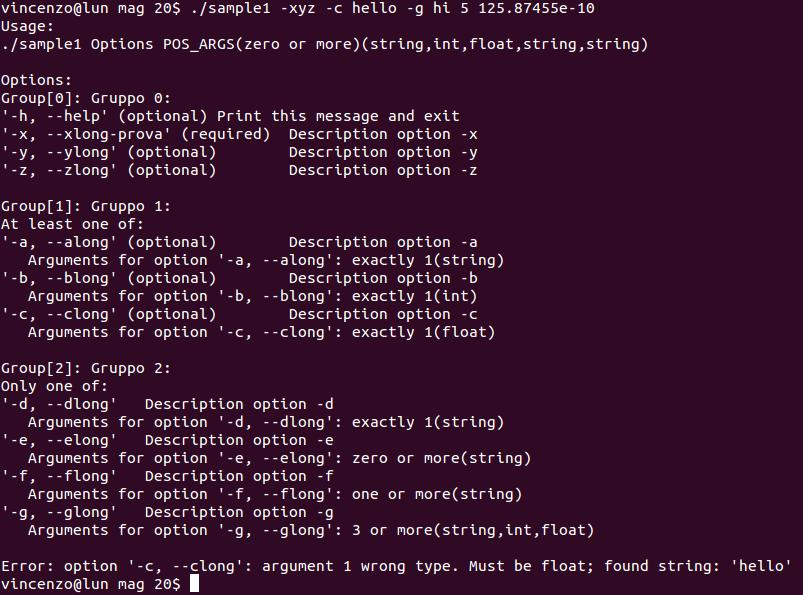
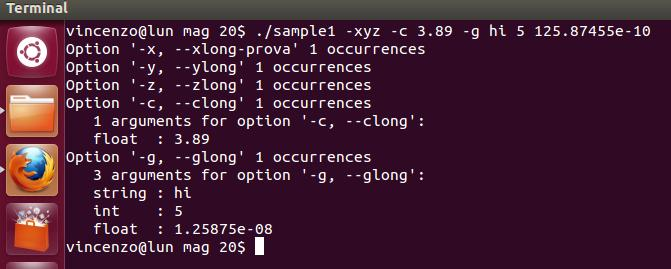

To use the library, you must include the file "myoptParser.h":

    #include "myoptParser.h"

You should also specify to the linker that we want to use the library "myoptParser" with the -l option.
For example:

    gcc -Wall -W -O2 -std=c99 -L. sample1.c -lmyoptParser -o sample1

User interface
--------------

The first thing to do is call the function "myopt_InitParser":

```c
    parser = myopt_InitParser();
    if ( !parser )
        return -1;
```

The function returns a pointer to the structure "_myopt_Parser_t".
This pointer is used as the first parameter in all other functions of the library and is, therefore, very important to verify that the "myopt_InitParser" does not return NULL before continuing.

The next step is to call the function "myopt_AddGroup":

```c
    idGroup = myopt_AddGroup(parser, "Group 0", false, false);
```

The prototype of the function "myopt_AddGroup is the following:

```c
    int32_t myopt_AddGroup(myopt_Parser_t parser, const char *strDescription, bool bMutuallyExclusive, bool bRequired);
```

The first parameter is the pointer returned by the function call "myopt_InitParser."
The parameter "strDescription" is the description of the group.
The parameter "bMutuallyExclusive" is a Boolean value; you must specify "true" if you want only one of the options the group is specified by the user on the command line. If this parameter is set to "true" and the user specifies more than one option in the group, the parser returns an error.
The parameter "bRequired" is a Boolean value: The value of "true" indicates that at least one (or one and only one if "bMutuallyEsclisive" == true) option of the group shall be specified by the user on the command line.

The next step is to add options to the previously created group, through 'the call to the function "myopt_AddOption."
The function prototype is as follows:


```c
    bool myopt_AddOption(myopt_Parser_t parser,
                         int32_t idGroup,
                         char shortName,
                         const char *longName,
                         const char *strDescription,
                         bool bRequired,
                         myopt_MOBEnum eMob,
                         int32_t nArgsMin,
                         int32_t nArgsMax,                     
                         const char *strTypes);
```

The parameter "bRequired" is taken into account if and only if the previous call to the function "myopt_AddGroup" was specified "false" for both the "bMutuallyExclusive" and "bRequired" parameters.

The parameter "eMob" is an enumerated type.
MOB = Multiple Occurrences Behavior.
Specifies the behavior that the parser assumes if the option is specified more than once.
It can assume the following values:

- MOB_ERROR - The parser returns an error.
- MOB_OVERRIDE - The parser will overwrite the value of previous arguments considering only the last one.
- MOB_APPEND - The parser returns a list of arguments.

The parameters "nArgsMin" and "nArgsMax" specify, respectively, the minimum and maximum number of option's arguments.
You can set both parameters to 0 if you want to specify an option that takes no arguments.
For the parameter "nArgsMax" you can use the macro OR_MORE.
For example, if you want the option accept zero or more arguments, set "nArgsMin" = 0 and "nArgsMax" = OR_MORE.
If you want the option accepts one or more arguments, set "nArgsMin" = 1 and "nArgsMax" = OR_MORE.
If you want the option accept three to five arguments, set "nArgsMin" = 3 and "nArgsMax" = 5.

The parameter "strTypes" is a string that specifies the type of the arguments of the option.
Can take on the values:

- "string" - specify a string argument.
- "int"    - specifies an argument of type integer number.
- "float"  - specifies an argument of type floating-point number.

If the option takes more arguments, you can specify the types separated by commas.
For example, if "nArgsMin" = 2 and "nArgsMax" = 2, we can set "strTypes" as "string, int."
If the types specified in "strTypes" are fewer in number than that specified by "nArgsMin" and "nArgsMax", the following arguments will assume the last type specified in the string.
For example, if "nArgsMin" = 3 and "nArgsMax" = 3 and "strTypes" = "string, float", the first argument will be of type "string", the second will be of type "float" and the the third will also be of type "float".
you can set "strTypes" to NULL or the empty string, "". In that case, the arguments will be considered of type "string".

By default, the parser accepts zero or more positional arguments, all of type "string".
If you want to change this behavior, you can call the function "myopt_SetPositionalArgsParams."
For example:

```c
    myopt_SetPositionalArgsParams(parser, "POS_ARGS", 0, 3, "string, int, float");
```

With the previous call the parser accept from zero to max 3 positional arguments.
If the user specifies more than three positional arguments the parser returns an error.
If we want our application does not accept positional arguments, we can make the following call:

```c
    myopt_SetPositionalArgsParams(parser, "POS_ARGS", 0, 0, "");
```

The next step is to call the function "myopt_ParseArray":

```c
    bParse = myopt_ParseArray(parser, argc, argv);
	
    if ( parser->countInternalErrors > 0 )
    {
        printf("Internal errors:\n");
        printf(parser->strInternalErrors);
        return -1;
    }		
```

The function returns true if the parser not found errors.
Even if the user has typed correctly the options on the command line, before proceeding you should check that the variable "countInternalErrors" is equal to zero.
A typical internal error might be an invalid type specification: "sting, int, float": "sting" instead of "string".

If everything is ok we can proceed to the reading of the options and related arguments:

```c
	if ( !bParse )
	{
		printf(parser->strUsage);
		printf(parser->strErrors);
		myopt_FreeParser(parser);
		return -1;		
	}
```

The following code fragment prints the list of options (and related arguments) entered by the user on the command line:

```c
	for ( x = 0; x < parser->countOptArgs; x++ )
	{
		if ( parser->arrayOptArgs[x].countOccurrences > 0 )
		{
			myopt_MakeOptionName(parser->arrayOptArgs[x].shortName, parser->arrayOptArgs[x].longName, strOptionName);
			printf("Option '%s' %d occurrences\n", strOptionName, parser->arrayOptArgs[x].countOccurrences);
			if ( parser->arrayOptArgs[x].countArgs > 0 )
				printf("   %d arguments for option '%s':\n", parser->arrayOptArgs[x].countArgs, strOptionName);
			for ( y = 0; y < parser->arrayOptArgs[x].countArgs; y++ )
			{
				switch ( parser->arrayOptArgs[x].arrayArgs[y].Type )
				{
					case T_STRING:			
						printf("   string : %s", parser->arrayOptArgs[x].arrayArgs[y].strValue);
						break;
					case T_INT:
						printf("   int    : %lli", (long long int)parser->arrayOptArgs[x].arrayArgs[y].intValue);
						break;
					case T_FLOAT:
						printf("   float  : %g", parser->arrayOptArgs[x].arrayArgs[y].floatValue);
						break;
				}
				printf("\n");
			}			
		}			
	}

```

To print the list of positional arguments:

```c
	if ( parser->countPosArgs )
		printf("\nList of positional argument:\n");
	for ( x = 0; x < parser->countPosArgs; x++ )
	{
		switch (parser->arrayPosArgs[x].Type )
		{
			case T_STRING:			
				printf("string : %s", parser->arrayPosArgs[x].strValue);
				break;
			case T_INT:
				printf("int    : %lli", (long long int)parser->arrayPosArgs[x].intValue);
				break;
			case T_FLOAT:
				printf("float  : %g", parser->arrayPosArgs[x].floatValue);
				break;
		}
		printf("\n");
	}
```

Finally, it is necessary to call the function "myopt_FreeParser" to free the memory allocated by the call to the function "myopt_InitParser":

```c
    myopt_FreeParser(parser);
```

A complete example:
===================

```c
#include <stdio.h>
#include <stdlib.h>
#include <string.h>
#include <stdint.h>
#include <stdbool.h>
#include <stdint.h>

#include "myoptParser.h"

int main(int argc, char* argv[])
{
	myopt_Parser_t parser;
	int x, y;
	char strOptionName[1024];
	char strDescr[MAX_LEN_STR + 1];
	int32_t idGroup;
	int32_t idOption;
	bool bParse;
		
	parser = myopt_InitParser();
	if ( !parser )
		return -1;

	idGroup = myopt_AddGroup(parser, "Gruppo 0", false, false);
	
	strcpy(strDescr, "Print this message and exit");
	myopt_AddOption(parser, idGroup, 'h', "help", strDescr, false, MOB_OVERRIDE, 0, 0, "");	

	strcpy(strDescr, "Description option -x");
	myopt_AddOption(parser, idGroup, 'x', "xlong-prova", strDescr, true, MOB_OVERRIDE, 0, 0, "");
	
	strcpy(strDescr, "Description option -y");	
	myopt_AddOption(parser, idGroup, 'y', "ylong", strDescr, false, MOB_OVERRIDE, 0, 0, "");
	
	strcpy(strDescr, "Description option -z");	
	myopt_AddOption(parser, idGroup, 'z', "zlong", strDescr, false, MOB_ERROR, 0, 0, "");


	idGroup = myopt_AddGroup(parser, "Gruppo 1", false, true);

	strcpy(strDescr, "Description option -a");
	myopt_AddOption(parser, idGroup, 'a', "along", strDescr, false, MOB_OVERRIDE, 1, 1, "string");
	
	strcpy(strDescr, "Description option -b");	
	myopt_AddOption(parser, idGroup, 'b', "blong", strDescr, false, MOB_APPEND, 1, 1, "int");
	
	strcpy(strDescr, "Description option -c");	
	myopt_AddOption(parser, idGroup, 'c', "clong", strDescr, false, MOB_APPEND, 1, 1, "float");
	
	
	idGroup = myopt_AddGroup(parser, "Gruppo 2", true, true);
	
	strcpy(strDescr, "Description option -d");	
	myopt_AddOption(parser, idGroup, 'd', "dlong", strDescr, false, MOB_OVERRIDE, 1, 1, "string");
	
	strcpy(strDescr, "Description option -e");	
	myopt_AddOption(parser, idGroup, 'e', "elong", strDescr, false, MOB_ERROR, 0, OR_MORE, "string");
	
	strcpy(strDescr, "Description option -f");	
	myopt_AddOption(parser, idGroup, 'f', "flong", strDescr, false, MOB_ERROR, 1, OR_MORE, "string");
	
	strcpy(strDescr, "Description option -g");	
	myopt_AddOption(parser, idGroup, 'g', "glong", strDescr, false, MOB_ERROR, 3, OR_MORE, "string, int, float");
	
	myopt_SetPositionalArgsParams(parser, "POS_ARGS", 0, OR_MORE, "string, int, float, string, string");
		
	bParse = myopt_ParseArray(parser, argc, argv);
	
	if ( parser->countInternalErrors > 0 )
	{
		printf("Internal errors:\n");
		printf(parser->strInternalErrors);
		return -1;
	}		
	
	//idOption = myopt_LookupShort(parser, 'h');
	idOption = myopt_LookupLong(parser, "help");
	if ( idOption >= 0 && parser->arrayOptArgs[idOption].countOccurrences > 0 )
	{
		printf(parser->strUsage);
		myopt_FreeParser(parser);
		return 0;
	}	
	
	if ( !bParse )
	{
		printf(parser->strUsage);
		printf(parser->strErrors);
		myopt_FreeParser(parser);
		return -1;		
	}
		
	for ( x = 0; x < parser->countOptArgs; x++ )
	{
		if ( parser->arrayOptArgs[x].countOccurrences > 0 )
		{
			myopt_MakeOptionName(parser->arrayOptArgs[x].shortName, parser->arrayOptArgs[x].longName, strOptionName);
			printf("Option '%s' %d occurrences\n", strOptionName, parser->arrayOptArgs[x].countOccurrences);
			if ( parser->arrayOptArgs[x].countArgs > 0 )
				printf("   %d arguments for option '%s':\n", parser->arrayOptArgs[x].countArgs, strOptionName);
			for ( y = 0; y < parser->arrayOptArgs[x].countArgs; y++ )
			{
				switch ( parser->arrayOptArgs[x].arrayArgs[y].Type )
				{
					case T_STRING:			
						printf("   string : %s", parser->arrayOptArgs[x].arrayArgs[y].strValue);
						break;
					case T_INT:
						printf("   int    : %lli", (long long int)parser->arrayOptArgs[x].arrayArgs[y].intValue);
						break;
					case T_FLOAT:
						printf("   float  : %g", parser->arrayOptArgs[x].arrayArgs[y].floatValue);
						break;
				}
				printf("\n");
			}			
		}			
	}
		
	if ( parser->countPosArgs )
		printf("\nList of positional argument:\n");
	for ( x = 0; x < parser->countPosArgs; x++ )
	{
		switch (parser->arrayPosArgs[x].Type )
		{
			case T_STRING:			
				printf("string : %s", parser->arrayPosArgs[x].strValue);
				break;
			case T_INT:
				printf("int    : %lli", (long long int)parser->arrayPosArgs[x].intValue);
				break;
			case T_FLOAT:
				printf("float  : %g", parser->arrayPosArgs[x].floatValue);
				break;
		}
		printf("\n");
	}
		
	myopt_FreeParser(parser);
	
	return 0;
}
```
<table border="0">
    <tr><td>.</td></tr>
    <tr><td></td></tr>
    <tr><td>.</td></tr>
    <tr><td></td></tr>
    <tr><td>.</td></tr>
    <tr><td></td></tr>
    <tr><td>.</td></tr>
    <tr><td></td></tr>
    <tr><td>.</td></tr>
    <tr><td></td></tr>    
</table>

